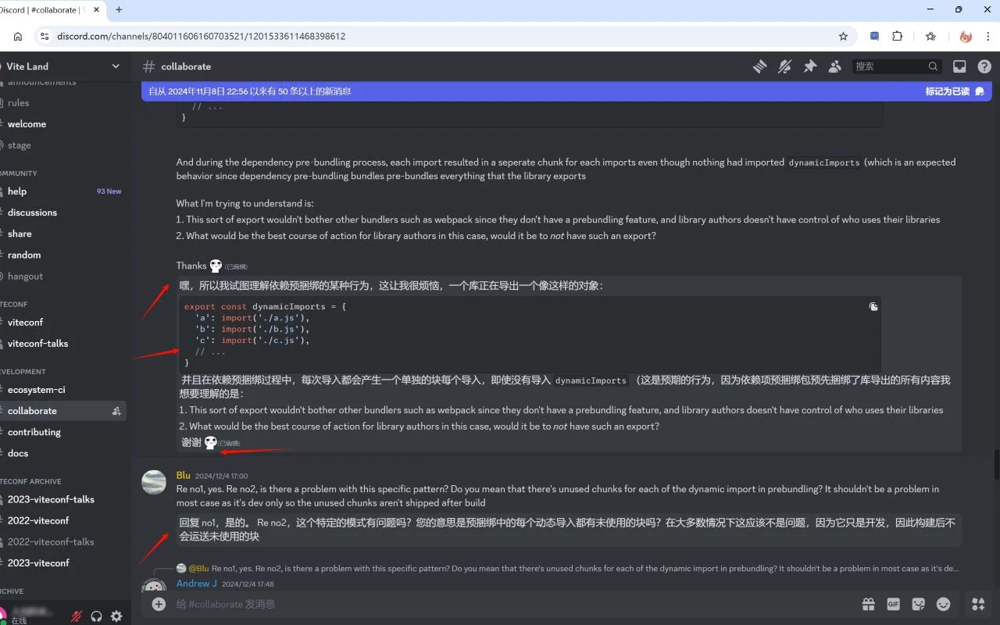
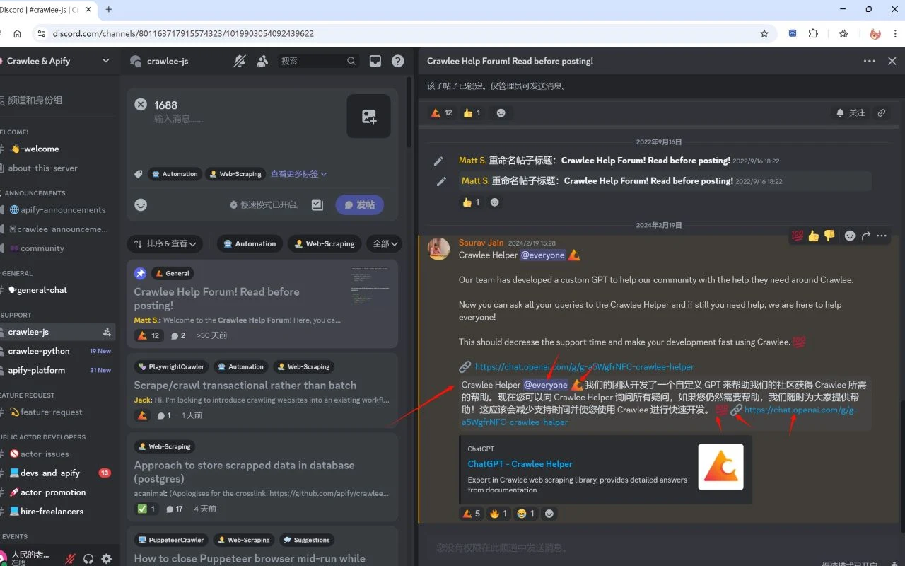
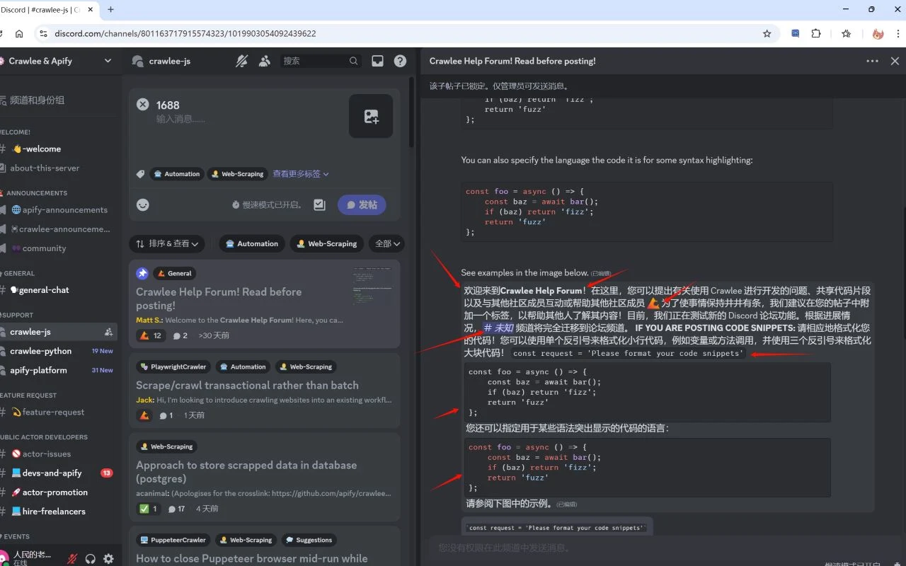

# 🚀 Discord 消息翻译器 发布笔记 | Discord Message Translator Release Notes

自动翻译消息列表，一键翻译输入框的消息到指定语言，全功能的双向沟通助手。

automatically translates message lists and one-click translates messages in the input box to a specified language, serving as a fully functional bidirectional communication assistant.

> 💡 **Feedback / 反馈**
>
> 遇到问题或有新功能建议？请在 [Issues](../../issues) 中告诉我们！
> If you encounter any issues or have suggestions, please let us know in the [Issues](../../issues)!

---

## 📜 历史版本 | Version History

### v4.1.0 - 功能增强 | Feature Enhancement

*   **📋 列表翻译支持 | List Translation Support**
    *   新增对有序列表（OL）和无序列表（UL）的翻译支持，保留完整的 HTML 列表结构，使复杂消息的阅读体验更佳。
    *   Added translation support for Ordered Lists (OL) and Unordered Lists (UL), preserving full HTML list structures for a better reading experience of complex messages.

### v4.0.0 - 双向沟通 | Bidirectional Communication

*   **✍️ 输入框一键翻译 | Input Box Translation**
    *   Discord 聊天输入框工具栏新增了一个翻译按钮（“文”字图标）。输入您的母语，点击按钮，内容将瞬间翻译为目标语言（如英文），助您轻松进行跨语言交流。
    *   A new translation button ("文" icon) has been added to the Discord chat toolbar. Type in your native language, click the button, and it will instantly translate your drafted text into the target language (e.g., English) ready for sending.

*   **🎨 设置面板 | Settings Panel**
    *   独立配置：您现在可以分别为“阅读”（接收消息）和“写作”（发送消息）设置不同的目标语言。
    *   Independent Configuration: You can now set different target languages for "Reading" (Incoming messages) and "Writing" (Outgoing messages).
*   [📸 效果展示 | Effect Display](../../issues/1)

### v3.0.0 - 体验升级 | Experience Upgrade

*   **⚡ 瞬时响应 | Instant Response**
    *   新消息实时监听，“秒”翻译，告别等待。
    *   Real-time monitoring for new messages; "instant" translation with zero waiting time.

*   **🧠 持久记忆 | Persistent Memory**
    *   翻译过的消息不再重复请求，加载更迅速且节省流量。
    *   Previously translated messages are cached locally, ensuring faster loading and reduced data usage.

*   **🎯 更精准的还原 | More Accurate Restoration**
    *   修复了表情、链接和特殊符号在翻译后可能出现的错位或乱码问题。
    *   Fixed issues where emojis, links, and special symbols might be misplaced or corrupted after translation.

*   **🌊 丝滑体验 | Seamless Experience**
    *   大幅优化性能，即使在千人活跃大群也能流畅运行。
    *   Greatly optimized performance, ensuring smooth operation even in highly active channels with thousands of members.

*   **🧹 智能管理 | Smart Management**
    *   自动清理过期缓存，保持系统清爽。
    *   Automatically cleans up expired cache data to keep your storage organized.

*   **📸 截图 | Screenshots**
    *   
    *   
    *   

### v2.2.0

*   **🐛 修复 | Bug Fix**
    *   修复无效翻译的问题。
    *   Fix invalid translation.

### v2.1.0

*   **💅 显示优化 | Display Optimization**
    *   优化已翻译消息的显示效果。
    *   Optimize the display of translated messages.

*   **🎨 主题适配 | Theme Adaptation**
    *   适配自定义主题。
    *   Adapt to custom themes.

### v2.0.0

*   **✨ UI 改进 | UI Improvement**
    *   在 v1 的基础上改进了 UI 显示，使其更加自然。在翻译复杂消息内容时能保持良好的可读性。
    *   On the basis of v1, the UI display has been improved and made more natural. Can maintain good readability when translating complex message content.

### v1.0.0

*   **🌱 基础功能 | Basic Function**
    *   自动将消息翻译成页面语言。
    *   Automatically translate messages into the page language.
