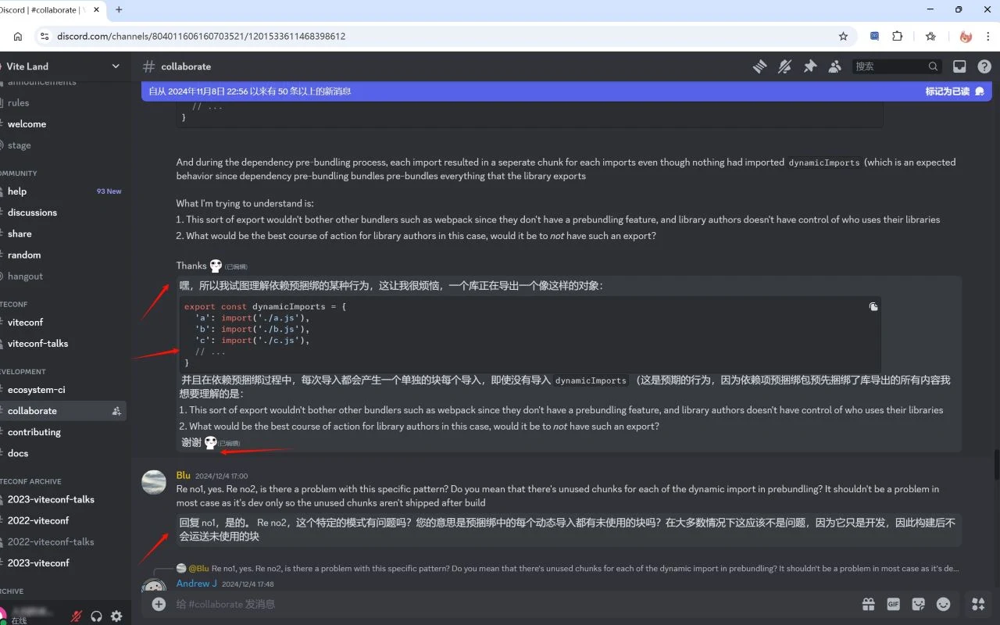
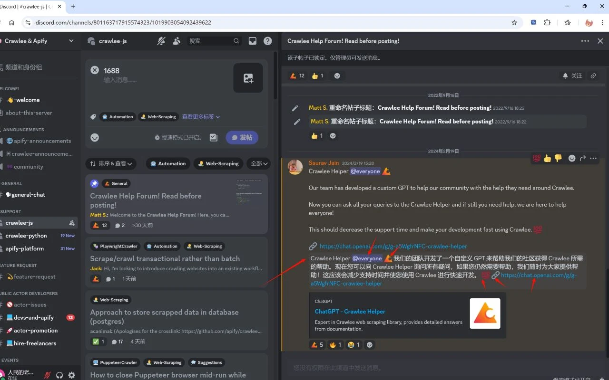
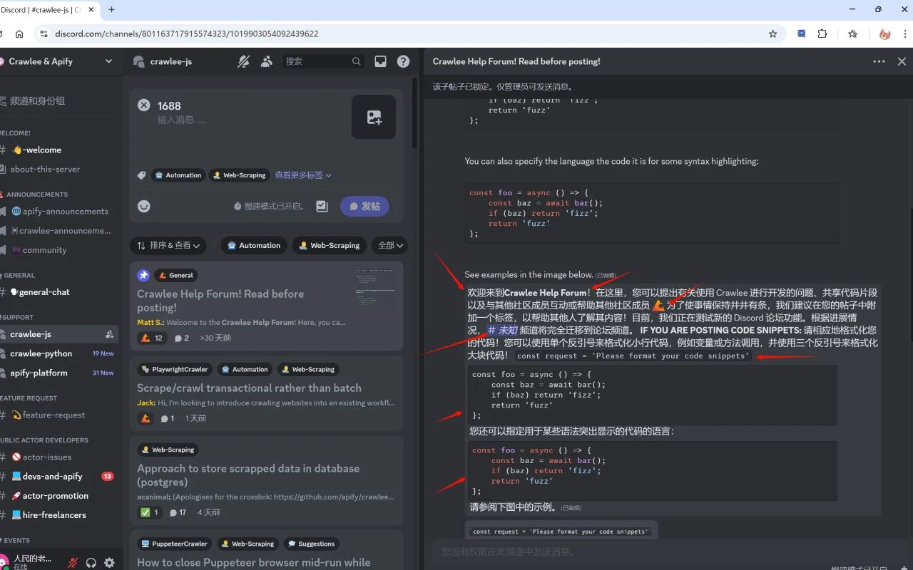

# 🚀 Примечания к выпуску Discord Translator

Автоматический перевод списков сообщений и перевод сообщений в поле ввода в один клик на выбранный язык. Полнофункциональный помощник для двустороннего общения.

> 💡 **Обратная связь**
>
> Столкнулись с проблемой или есть предложения? Дайте нам знать в [Issues](../../issues)!

---

## 📜 История версий

### v4.2.3 — Более аккуратное отображение эмодзи

*   **✨ Без лишних блоков перевода**
    *   Сообщения, состоящие только из эмодзи, больше не отправляются на перевод и не получают дублирующий блок перевода, поэтому активные чаты легче читать.
*   **💬 Смешанные сообщения по-прежнему переводятся**
    *   Сообщения с текстом и эмодзи переводятся как обычно, а исходные эмодзи сохраняются.

### v4.2.2 — Более ясные метаданные магазина

*   **📝 Краткое описание**
    *   Локализованные названия и сводки сокращены и теперь описывают функции без повторения поисковых фраз.
*   **🛡️ Соответствие требованиям**
    *   Из текста страницы удалены отдельные списки ключевых слов; функции и разрешения расширения не изменились.

### v4.2.1 — Выбор языка интерфейса

*   **🌐 Ручной выбор языка**
    *   Можно выбрать любую из 55 поддерживаемых локалей интерфейса или оставить автоматическое определение по языку браузера.
*   **⚡ Мгновенное обновление интерфейса**
    *   Язык и направление текста сразу меняются во всплывающем окне и в элементах управления на странице Discord.
*   **🛡️ Плавное обновление**
    *   Существующие настройки перевода не изменяются, а прежний выбор английского или китайского языка сохраняется.

### v4.2.0 — Глобальная локализация

*   **🌍 Поддержка 55 локалей**
    *   Язык интерфейса теперь соответствует языку браузера, а английский используется как надёжный резервный вариант.
*   **🔎 Локализованное представление в магазине**
    *   Добавлены локализованные названия и описания, отражающие перевод в реальном времени в обоих направлениях.
*   **🧭 Региональная терминология и RTL**
    *   Уточнены региональные формулировки и добавлена поддержка интерфейса справа налево для арабского, иврита и персидского языков.
*   **🪶 Совместимость и компактность**
    *   Существующие настройки чтения и отправки сообщений сохраняются, новые разрешения не требуются.

### v4.1.1 - Оптимизация опыта

*   **🎨 Визуальное обновление**
    *   Новый дизайн в стиле Discord: более современный и чистый интерфейс с оптимизированным макетом карточек и цветовой схемой.
*   **🔔 Уведомление о несохраненных изменениях**
    *   Добавлен индикатор несохраненных изменений в реальном времени, чтобы ваши настройки были применены и вы не забыли их сохранить.
*   **🔗 Быстрый доступ**
    *   В нижней части всплывающего окна добавлены прямые ссылки на «Руководство» и «Обратную связь» для удобства новых пользователей.

### v4.1.0 - Улучшение функционала

*   **📋 Поддержка перевода списков**
    *   Добавлена поддержка перевода упорядоченных (OL) и неупорядоченных списков (UL) с сохранением полной структуры HTML для лучшего чтения сложных сообщений.

### v4.0.0 - Двустороннее общение

*   **✍️ Перевод поля ввода в один клик**
    *   На панель инструментов ввода чата Discord добавлена новая кнопка перевода (иконка «文»). Введите текст на родном языке, нажмите кнопку, и он мгновенно будет переведен на целевой язык (например, английский).

*   **🎨 Панель настроек**
    *   Независимая конфигурация: теперь вы можете устанавливать разные целевые языки для «Чтения» (входящие сообщения) и «Письма» (исходящие сообщения).
*   [📸 Демонстрация эффектов](../../issues/1)

### v3.0.0 - Обновление опыта

*   **⚡ Мгновенный отклик**
    *   Мониторинг новых сообщений в реальном времени; «мгновенный» перевод без ожидания.

*   **🧠 Постоянная память**
    *   Ранее переведенные сообщения кэшируются локально, что обеспечивает более быструю загрузку и снижение расхода трафика.

*   **🎯 Более точное восстановление**
    *   Исправлены проблемы, из-за которых эмодзи, ссылки и специальные символы могли быть смещены или повреждены после перевода.

*   **🌊 Плавный опыт**
    *   Значительно оптимизирована производительность, обеспечивающая плавную работу даже в высокоактивных каналах с тысячами участников.

*   **🧹 Умное управление**
    *   Автоматическая очистка устаревшего кэша для поддержания порядка в хранилище.

*   **📸 Скриншоты**
    *   
    *   
    *   

### v2.2.0

*   **🐛 Исправление ошибок**
    *   Исправлена ошибка неработающего перевода.

### v2.1.0

*   **💅 Оптимизация отображения**
    *   Оптимизация отображения переведенных сообщений.

*   **🎨 Адаптация темы**
    *   Адаптация под пользовательские темы.

### v2.0.0

*   **✨ Улучшение интерфейса**
    *   Интерфейс был улучшен и стал более естественным по сравнению с v1. Сохраняет хорошую читаемость при переводе сложных сообщений.

### v1.0.0

*   **🌱 Базовая функция**
    *   Автоматический перевод сообщений на язык страницы.
